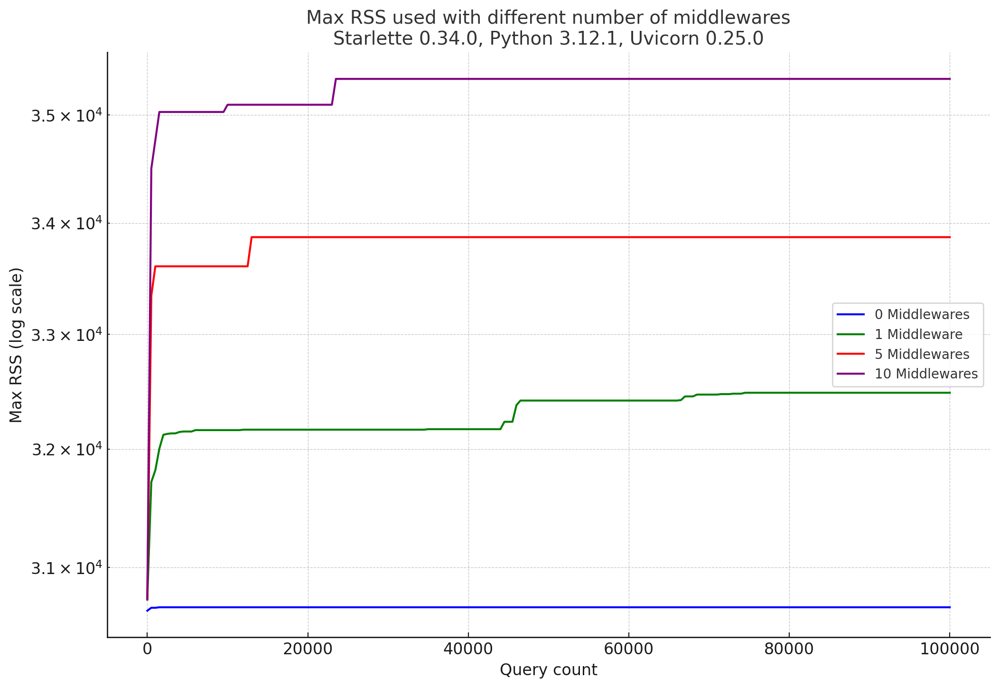
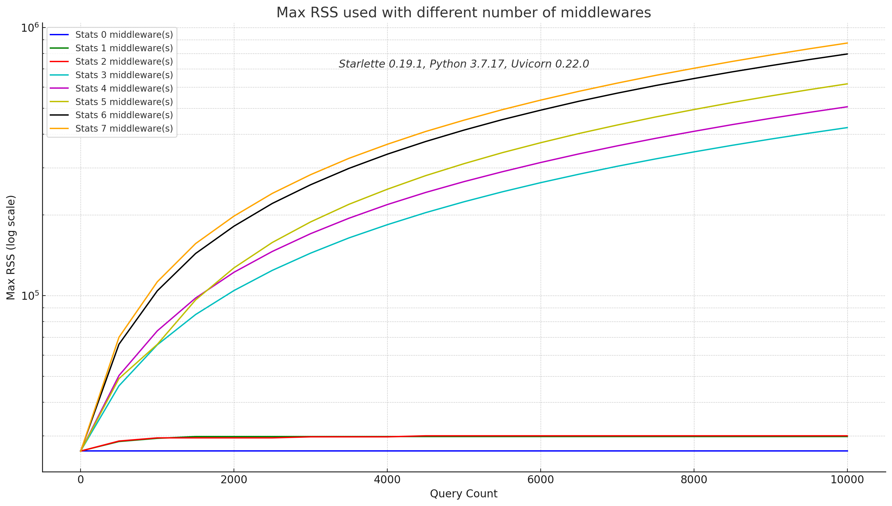

# Test suite for [Starlette discussion #1843](https://github.com/encode/starlette/discussions/1843)

This project is a test suite trying to detect a memory leak in Starlette, when using middlewares.

See https://github.com/encode/starlette/discussions/1843






## Requirements

- docker
- python 3.10+

```shell
git clone https://github.com/thomasleveil/test-starlette-memory-leak.git
cd test-starlette-memory-leak
pip install -r requirements.txt
```

## Usage

```shell
pytest
```

and be patient


## Configuration

See the top section of [tests/test_leaks.py](tests/test_leaks.py)

